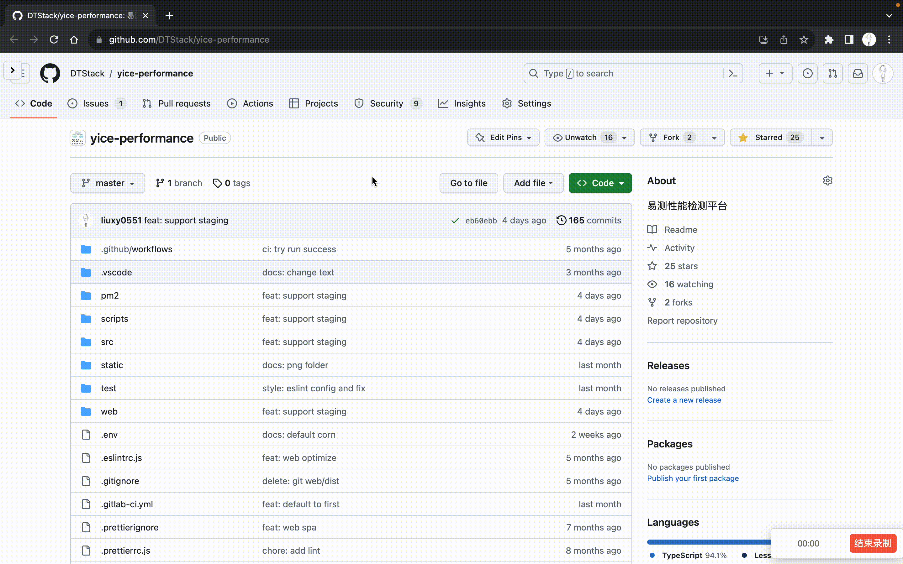
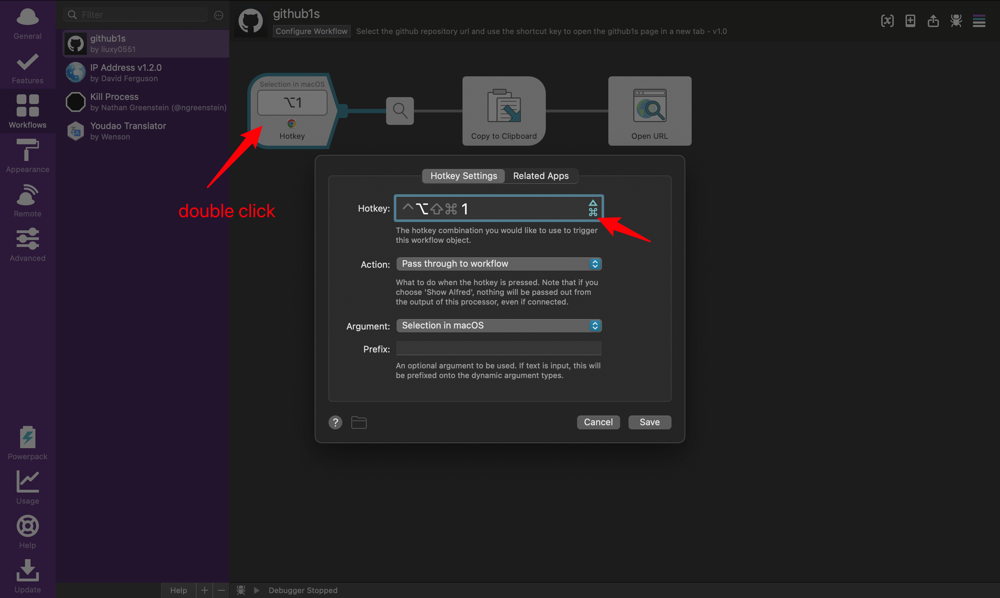

# alfred-workflow-github1s

## Usage

1. Select github repository url.  
2. Press `option` + `1` to open a new tab with github1s.com.  

## Demonstration

## Install

Download and open file using [Alfred](https://www.alfredapp.com/).

Open [`github1s.alfredworkflow`](https://github.com/liuxy0551/alfred-workflow-github1s/releases) and Alfred will walk you through the installation process. No configuration is necessary.

P.S.: You need to [buy the Powerpack](https://buy.alfredapp.com/) to use these workflows.

## Change For Yourself

1. Change the shortcut key.

